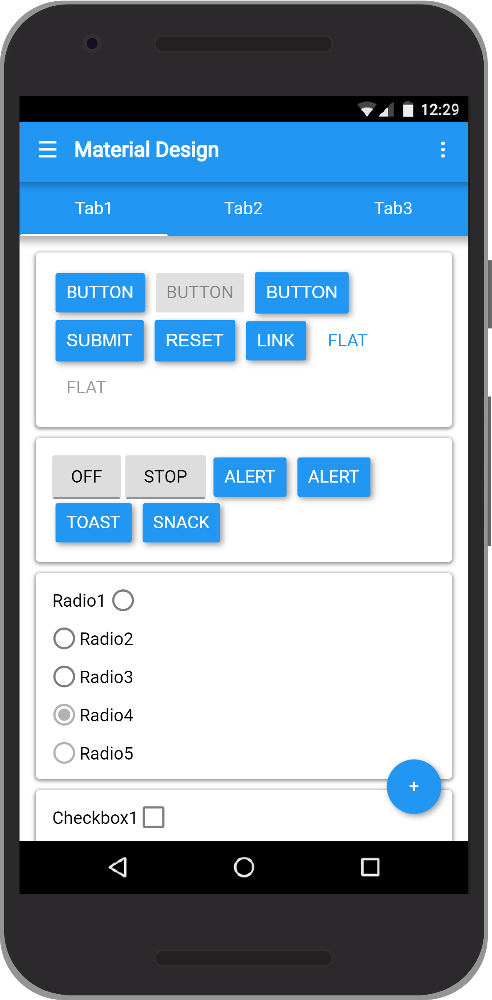
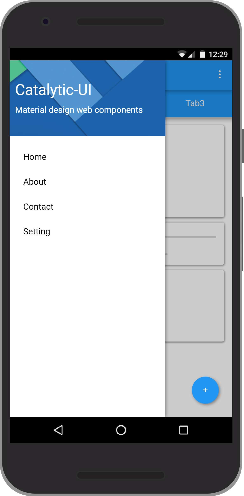

<div align="center">
  
  <h1>Catalytic-UI</h1>
  
  <p>Catalytic-UI is a lightweight UI Toolkit for easing the development of hybrid mobile apps or progressive web apps based on Google's Material Design guidelines. It lets you add a Material Design look and feel to your hybrid app without getting into the core of android.</p>


</div>
<hr/>


## Key Features:
<div>
  <ul>
    <li>Free and open source</li>
    <li>Lightweight (CSS 3.5KB gzipped | JS 1.8KB gzipped)</li>
    <li>No external dependencies</li>
    <li>Fully responsive layout for mobile and tablet view</li>
    <li>Easy to customize (Available in SASS)</li>
  </ul>
</div>


## QUICKSTART:

**Use From the CDN:**

```html
<link href="https://cdn.rawgit.com/amitdabade/catalytic-ui/master/src/catalytic.min.css" rel="stylesheet" type="text/css" />
<script src="https://cdn.rawgit.com/amitdabade/catalytic-ui/master/src/catalytic.min.js"></script>
```

Alternatively you can download repository and start using locally. 


**HTML boilerplate code:**

```html
<!DOCTYPE html>
<html>
  <head>
    <title>Catalytic UI</title>
    <meta name="viewport" content="width=device-width, initial-scale=1.0">
    <link href="https://cdn.rawgit.com/amitdabade/catalytic-ui/master/src/catalytic.min.css" rel="stylesheet" type="text/css" />
    <link href="https://fonts.googleapis.com/css?family=Roboto" rel="stylesheet">
  </head>
  <body>
    <button class="mt-button">Button</button>
    <script src="https://cdn.rawgit.com/amitdabade/catalytic-ui/master/src/catalytic.min.js"></script>
  </body>
</html>
```


## Demo:
Check out demo - [Demo](https://codepen.io/amitdabade/pen/rpGQyV)

## Preview:
<div>
  
  
</div>  


## License:

This project is licensed under the terms of the
[MIT license](/LICENSE).
